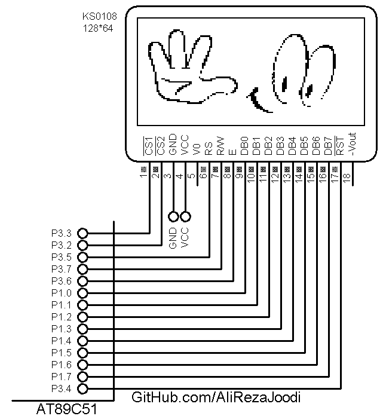

## Graphical LCD Display With SED KS0108 Contorollers

MCU:			AT89C51    
Frequency:     		8MHz (External Crystal)    
Display:        	64x128 GLCD   

### Folder and Files Description
It has included:
- `Code_mikroC for 8051` (Code with C Language)
- `Simulate` (Simulator File)

### Simulate: v1.0

My GitHub Account: [GitHub.com/AliRezaJoodi](https://github.com/AliRezaJoodi)  
**Note**: [You can go here to download a single folder or file from GitHub.com](https://minhaskamal.github.io/DownGit/#/home)
