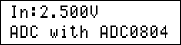
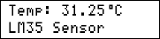

## 8051 Programming Exercises
A repository for my personal exercises

### Gallery of the Repository

### Table of Contents
|Title|Bascom8051|mikroC for 8051|Keil C51|
|:----|:--------:|:-------------:|:------:|
|[ADC_ExternalADC_ADC0804](ADC_ExternalADC_ADC0804)|Y|-|-|
|[Display_7Segment_1Digit](Display_7Segment_1Digit)|Y|-|-|
|[Display_7Segment_8Digit_Using7447](Display_7Segment_8Digit_Using7447)|Y|-|-|
|[Display_GLCD_KS0108](Display_GLCD_KS0108)|-|Y|-|
|[Display_LCD](Display_LCD)|Y|Y|-|
|[Sensor_Thermometer_LM35](Sensor_Thermometer_LM35)|Y|-|-|
|[UART_SoftwareUART](UART_SoftwareUART)|Y|-|-|

