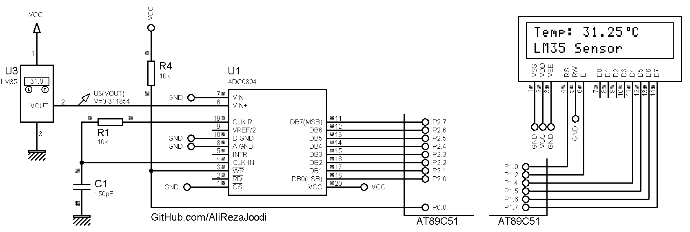

## Thermometer Using LM35
	   
MCU:			AT89S51    
Frequency:     		8MHz (External Crystal)   
Display:        	16x2 Alphanumeric LCD   	

### Folder and Files Description
It has included:
- `Code_Bascom8051` (Code with Basic Language)
- `Hardware` (Included hardware layers)

### Simulate: v1.0

My GitHub Account: [GitHub.com/AliRezaJoodi](https://github.com/AliRezaJoodi)  
**Note**: [You can go here to download a single folder or file from GitHub.com](https://minhaskamal.github.io/DownGit/#/home)
